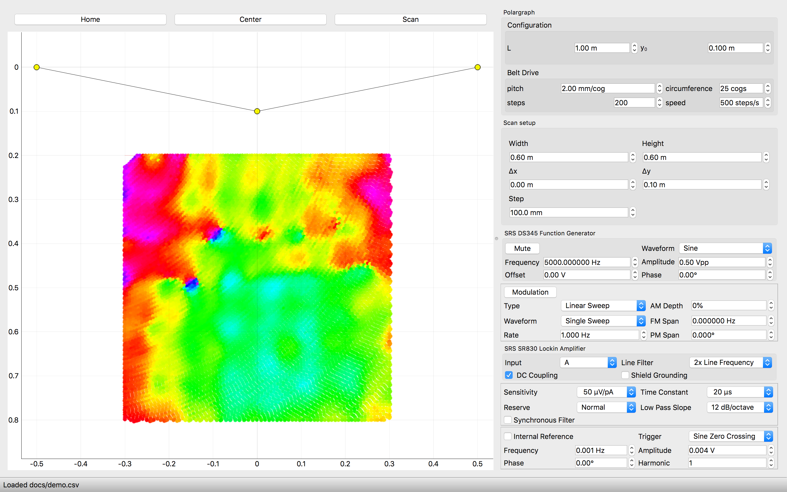

# QAcousticCamera

[](https://pypi.org/project/QAcousticCamera/)
[](https://doi.org/10.5281/zenodo.13822360)
[](LICENSE.md)

Scanning holographic acoustic camera based on
lock-in detection of the signal from a microphone
that is scanned across the field of view by an
Arduino-driven polargraph. This illustration of the software
interface shows the phase of a 5 kHz sound wave from a stereo
speaker, including reflections from nearby surfaces.



Image Credit: Aashay Pai, NYU

## Installation

```bash
pip install -r requirements.txt
```

The following packages must be installed separately:

- [QPolargraph](https://github.com/davidgrier/QPolargraph/): polargraph scanner control
- [QInstrument](https://github.com/davidgrier/QInstrument/): Qt-based instrument widgets

## Usage

```bash
# Connect to hardware instruments
python QAcousticCamera.py

# Development/testing without hardware
python QAcousticCamera.py --fake

# Load a previously saved data file on startup
python QAcousticCamera.py --read docs/demo.csv
```

Or, if installed via pip:

```bash
qacousticcamera [--fake] [--read FILE]
```

## Dependencies

- [QInstrument](https://github.com/davidgrier/QInstrument/): Qt-based scientific instrument framework
- [QPolargraph](https://github.com/davidgrier/QPolargraph/): polargraph scanner
- [pyqtgraph](https://pyqtgraph.org/): real-time scientific graphics
- [qtpy](https://github.com/spyder-ide/qtpy): Qt binding abstraction (PyQt5, PyQt6, or PySide6)
- [numpy](https://numpy.org/), [pandas](https://pandas.pydata.org/), [scipy](https://scipy.org/)

## License

This project is licensed under the
[GNU General Public License v3](LICENSE.md).

## References

1. Flexible wide-field high-resolution scanning camera for
   continuous-wave acoustic holography, H. W. Gao, K. I. Mishra,
   A. Winters, S. Wolin and D. G. Grier,
   *Review of Scientific Instruments* **89**, 114901 (2018).

## Acknowledgements

Work on this project at New York University is supported by the
National Science Foundation of the United States under award number DMR-2438983.
