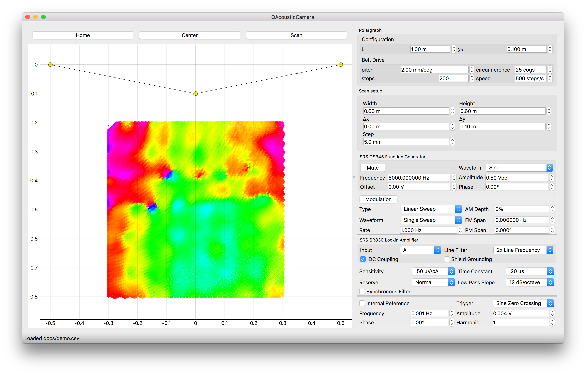

# QAcousticCamera

Scanning holographic acoustic camera based on 
locked-in detection of the signal from a microphone
that is scanned across the field of view by an
Arduino-driven polargraph. This illustration of the GUI
interface shows the phase of a 5 kHz sound wave from a stereo
speaker, including reflections from nearby surfaces.

Image Credit: Aashay Pai, NYU

## Dependencies
1. [QInstrument](https://github.com/davidgrier/QInstrument/): Software abstractions of scientific instruments with PyQt5 interfaces.
2. [QPolargraph](https://github.com/davidgrier/QPolargraph/): Two-dimensional scanner.
4. [pyqtgraph](https://pyqtgraph.org/): Real-time scientific graphics for PyQt5.
5. [PyQt5](https://pypi.org/project/PyQt5/): Cross-platform GUI application framework.

## References
1. Flexible wide-field high-resolution scanning camera for continuous-wave acoustic holography, H. W. Gao, K. I. Mishra, A. Winters, S. Wolin and D. G. Grier, Review of Scientific Instruments 89, 114901 (2018).

## Acknowledgements

Work on this project at New York University is supported by
the National Science Foundation of the United States under
award number DMR-2104837.
